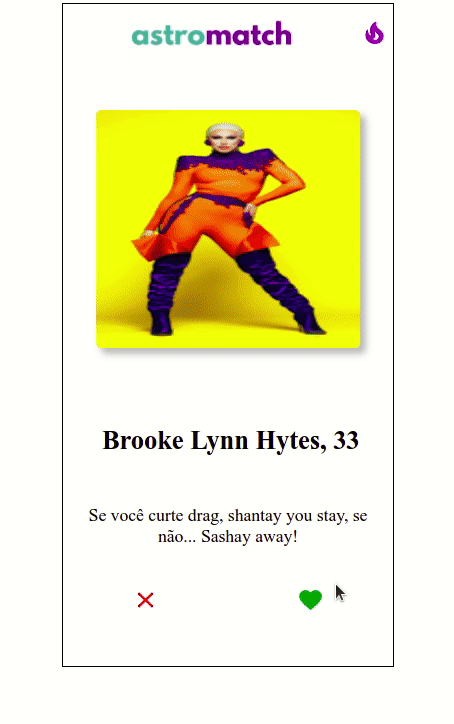

# Astromatch 💘🚀
Projeto em React, simulando uma plataforma de relacionamento.
## Funcionalidades

 - Opções de personalidades para tentar dar o macth ou não
 - Visualização da lista de matches;
 - Limpar lista de macthes e criar uma nova

  

## Aprendizados

  

Com a realização deste projeto consegui entender o uso de props, axios, criação de componentes com responsabilidades únicas, utilização de useEffect e useState, async e await, renderização condicional e ternários.

## Stack utilizada

**Front-end:** React, js, Material UI, SweetAlert2

- Requisições de API (GET, PUT, POST)

- Estilização com Material UI e SweetAlert2

- Telas dinâmicas

## Instalação

 - No seu terminal faça o clone deste repositório com o comando `git clone https://github.com/karlanatany/astroMatch.git`
 - Abra o projeto no editor de sua preferência
 - Abra o terminal no editor e rode o comando `npm install` para serem instaladas as dependências utilizadas no projeto 
 - Após dê o comando `npm start` para a aplicação abrir no seu navegador
## Visualização 🧐

👓  [VISUALIZAR APLICAÇÃO WEB](https://accurate-drain.surge.sh/)